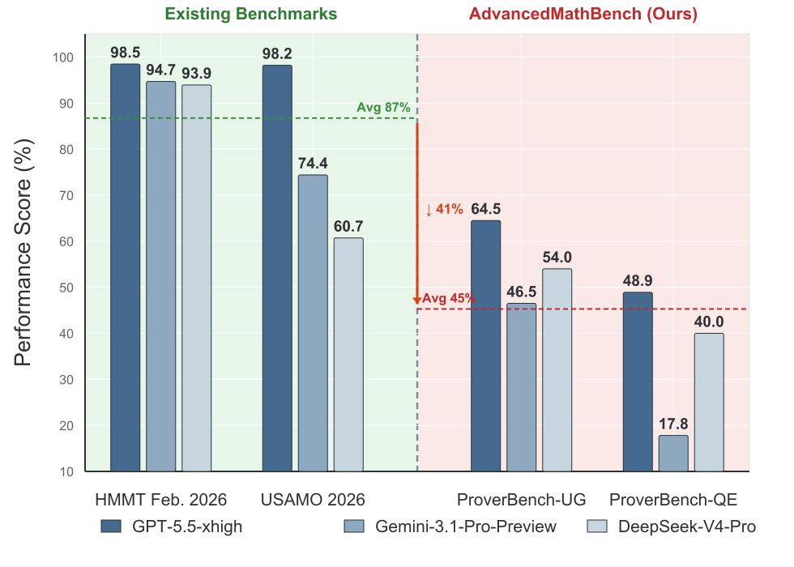
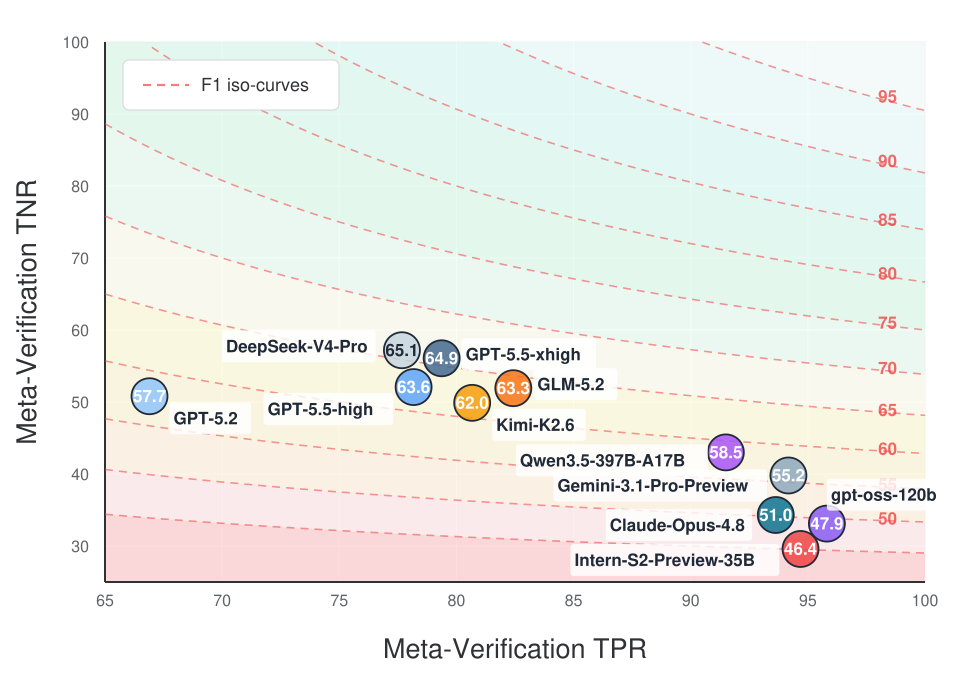
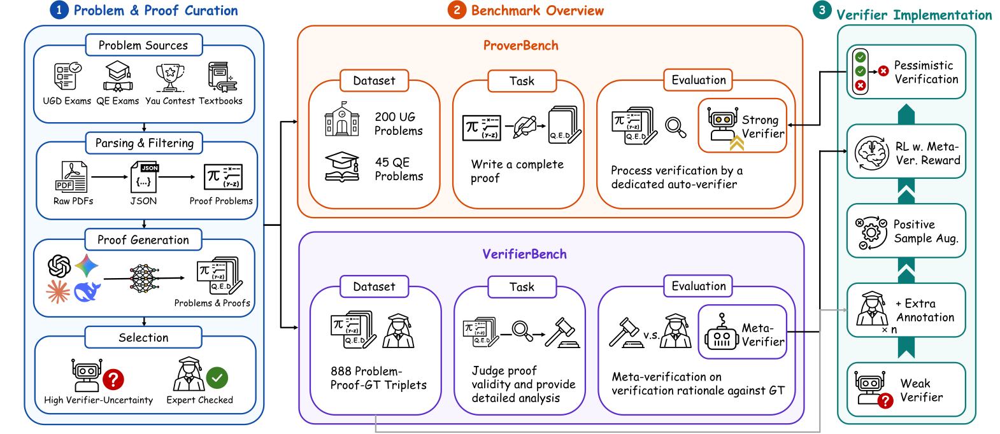

# AdvancedMathBench: A Benchmark Suite for Advanced Mathematical Proof Generation and Verification

<p align="center">
  <a href="https://arxiv.org/abs/2607.11849"></a>
  <a href="https://huggingface.co/papers/2607.11849"></a>
  <a href="https://huggingface.co/datasets/debouter/AdvancedMathBench"></a>
  <a href="https://huggingface.co/debouter/AdvancedMathBench-AutoVerifier"></a>
</p>

<p align="center">
  Lingkai Kong, Zijian Wu, Yuzhe Gu, Haiteng Zhao, Zhouqi Hua, Wenyong Huang,<br>
  Shuang Sun, Zhicheng Xiong, Xiaotian Zhang, Shuya Zhao, Yan Wang, Disheng Xu,<br>
  Wenwei Zhang, Kai Chen
</p>

## Overview

AdvancedMathBench evaluates whether language models can **construct and verify
natural-language proofs in advanced mathematics**. It covers undergraduate-level
(UG) and qualifying-examination-level (QE) mathematics, with problems drawn from
examinations, mathematics competitions, and textbooks.

- **ProverBench** contains 245 expert-reviewed problems for proof generation.
- **VerifierBench** contains 888 proof trajectories with full-chain expert
  annotations, including fatal errors, recoverable errors, and explanations.
- **AutoVerifier** is a trained proof verifier for automated ProverBench evaluation.
  The default pessimistic protocol accepts a proof only when all eight judgments
  accept it. VerifierBench additionally uses meta-verification to assess whether
  a model's error analysis agrees with expert annotations.

<p align="center">
  
  
</p>

*Figure 1. Model performance on AdvancedMathBench. Left: proof-generation
performance compared with HMMT and USAMO. Right: meta-verification TPR and TNR;
marker labels show Balanced F1.*

<p align="center">
  
</p>

*Figure 2. Overview of benchmark construction and the automatic verification
pipeline.*

| Benchmark     | Evaluation unit | UG (`ugd`) | QE (`qe`) | Total |
| ------------- | --------------- | -----------: | ----------: | ----: |
| ProverBench   | Problem         |          200 |          45 |   245 |
| VerifierBench | Annotated proof |          168 |         720 |   888 |

The overview and results below follow the final manuscript dated September 28,
2026. The initial arXiv version describes an earlier ProverBench revision; see
[release notes](docs/release_notes.md) for version details.

### Main results (Table 1)

Main results on ProverBench and VerifierBench from the final manuscript, in
percent. ProverBench uses pessimistic proof acceptance. VerifierBench reports
both correct/incorrect polarity (Rough) and agreement with expert error analyses
(Meta-Verification). Bal. F1 is the harmonic mean of TPR and TNR.

<table>
  <thead>
    <tr><th rowspan="3">Model</th><th colspan="2">ProverBench</th><th colspan="6">VerifierBench</th></tr>
    <tr><th rowspan="2">UG</th><th rowspan="2">QE</th><th colspan="3">Rough</th><th colspan="3">Meta-Verification</th></tr>
    <tr><th>TPR</th><th>TNR</th><th>Bal. F1</th><th>TPR</th><th>TNR</th><th>Bal. F1</th></tr>
  </thead>
  <tbody>
    <tr><th colspan="9" align="left"><em>Proprietary Models</em></th></tr>
    <tr><td>GPT-5.5-xhigh</td><td><strong>64.5</strong></td><td><strong>48.9</strong></td><td>78.9</td><td>73.3</td><td><strong>76.0</strong></td><td>78.9</td><td>55.1</td><td>64.9</td></tr>
    <tr><td>GPT-5.5-high</td><td>53.3</td><td>46.1</td><td>78.4</td><td><strong>73.8</strong></td><td><strong>76.0</strong></td><td>78.3</td><td>53.6</td><td>63.6</td></tr>
    <tr><td>GPT-5.2</td><td>53.0</td><td>26.7</td><td>66.9</td><td>65.0</td><td>65.9</td><td>66.9</td><td>50.8</td><td>57.7</td></tr>
    <tr><td>Gemini-3.1-Pro-Preview</td><td>46.5</td><td>17.8</td><td>94.0</td><td>49.0</td><td>64.4</td><td>94.0</td><td>39.1</td><td>55.2</td></tr>
    <tr><td>Claude-Opus-4.8</td><td>59.0</td><td>40.0</td><td><strong>96.4</strong></td><td>37.9</td><td>54.4</td><td>93.8</td><td>35.0</td><td>51.0</td></tr>
    <tr><th colspan="9" align="left"><em>Open-source Models</em></th></tr>
    <tr><td>DeepSeek-V4-Pro</td><td>54.0</td><td>40.0</td><td>78.1</td><td>70.6</td><td>74.1</td><td>78.1</td><td><strong>55.8</strong></td><td><strong>65.1</strong></td></tr>
    <tr><td>Qwen3.5-397B-A17B</td><td>40.0</td><td>33.5</td><td>91.5</td><td>55.2</td><td>68.9</td><td>91.5</td><td>43.0</td><td>58.5</td></tr>
    <tr><td>Kimi-K2.6</td><td>48.0</td><td>20.0</td><td>80.8</td><td>63.1</td><td>70.9</td><td>80.8</td><td>50.3</td><td>62.0</td></tr>
    <tr><td>GLM-5.2</td><td>44.5</td><td>28.9</td><td>82.5</td><td>66.9</td><td>73.9</td><td>82.3</td><td>51.5</td><td>63.3</td></tr>
    <tr><td>gpt-oss-120b</td><td>20.5</td><td>2.2</td><td>95.2</td><td>38.7</td><td>55.0</td><td><strong>95.3</strong></td><td>32.0</td><td>47.9</td></tr>
    <tr><td>Intern-S2-Preview-35B</td><td>27.0</td><td>16.7</td><td>95.2</td><td>38.7</td><td>55.0</td><td>95.2</td><td>30.7</td><td>46.4</td></tr>
  </tbody>
</table>

Strong proof generation does not necessarily imply strong proof verification.
Binary verdict accuracy can also hide incorrect error explanations. See the
[results notes](docs/results.md) for metric definitions and reproduction scope.

## Quick start

Python 3.10+ is required. Run the following commands from this repository's root.
The API evaluator has no internal-repository dependencies and uses the Python
standard library; the `hub` extra installs the Hugging Face download tools.

```bash
python -m pip install -e '.[hub]'
bash scripts/download_data.sh
```

This downloads both benchmark files at a pinned revision and checks their
SHA256 hashes. If access requires authentication, run `hf auth login` first
with an authorized account. See [data documentation](data/README.md).

### ProverBench

Configure an API prover and an AutoVerifier endpoint:

```bash
cp configs/prover_api.example.json configs/prover_api.local.json
export POLICY_API_KEY="YOUR_API_KEY"
# Edit the model names and endpoint URLs in the local config.
python -m advancedmathbench prover \
  --data data/proverbench/test.jsonl \
  --config configs/prover_api.local.json \
  --output outputs/prover \
  --samples 4 --verifier-repeats 8 --dry-run
```

`--dry-run` validates inputs and shows the call budget without calling models.
Remove it to run evaluation. Each of the four generated proofs per problem
receives eight independent verifier judgments. The example requires a deployed
AutoVerifier; it does not start a model server.

### VerifierBench

Configure the model to evaluate as a verifier:

```bash
cp configs/verifier_api.example.json configs/verifier_api.local.json
export VERIFIER_API_KEY="YOUR_API_KEY"
# Edit the model name and endpoint URL in the local config.
python -m advancedmathbench verifier \
  --data data/verifierbench/test.jsonl \
  --config configs/verifier_api.local.json \
  --output outputs/verifier --verifier-repeats 1 --dry-run
```

Remove `--dry-run` to run. For explanation-quality evaluation, use
`configs/verifier_meta.example.json` with `--meta`; the manuscript uses
gpt-oss-120b as the meta-verifier.

See the [evaluation guide](docs/evaluation.md) for meta-verification, local model
loading, domain filters, outputs, and resuming. The [metrics reference](docs/metrics.md)
defines scoring and invalid-output handling. CLI scores are on 0–1; paper tables
use percentages. Example settings are not a turnkey reproduction of paper results.

## AutoVerifier

The [model repository](https://huggingface.co/debouter/AdvancedMathBench-AutoVerifier)
contains the checkpoint, tokenizer, and proof-verification prompt. To download
the pinned checkpoint separately:

```bash
bash scripts/download_verifier.sh
```

The checkpoint is approximately 68 GiB. Optional local inference uses public
Transformers; see the [setup and compatibility notes](docs/evaluation.md#optional-use-local-transformers-for-autoverifier)
before loading it. Full GPU inference has not been validated by the offline tests.

## Repository layout

```text
advancedmathbench/   Standalone evaluator and bundled task prompts
assets/             Paper figures in SVG format
configs/            API and local-model configuration examples
data/               Dataset download instructions and checksums
docs/               Evaluation, metrics, results, and release notes
scripts/            Pinned dataset and checkpoint download helpers
tests/              Offline tests; no credentials or model weights needed
CITATION.cff        Machine-readable paper citation
citation.bib        BibTeX citation
```

Run tests with `python -m unittest discover -s tests -v`.
See [validation](docs/validation.md) for the tested scope.

## Licensing

No code license is declared at this time. Dataset and model terms are separate;
see [licensing notes](docs/licensing.md) and the respective Hugging Face repositories.

## Citation

If you use AdvancedMathBench, please cite the paper. The citation below follows
the current arXiv author list. Also available as [BibTeX](citation.bib) and [CITATION.cff](CITATION.cff).

```bibtex
@misc{kong2026advancedmathbenchbenchmarksuiteadvanced,
  title = {AdvancedMathBench: A Benchmark Suite for Advanced Mathematical Proof Generation and Verification},
  author = {Lingkai Kong and Zijian Wu and Yuzhe Gu and Haiteng Zhao and Wenyong Huang and Shuang Sun and Zhicheng Xiong and Xiaotian Zhang and Shuya Zhao and Yan Wang and Disheng Xu and Wenwei Zhang and Kai Chen},
  year = {2026},
  eprint = {2607.11849},
  archivePrefix = {arXiv},
  primaryClass = {cs.CL},
  doi = {10.48550/arXiv.2607.11849},
  url = {https://arxiv.org/abs/2607.11849}
}
```
